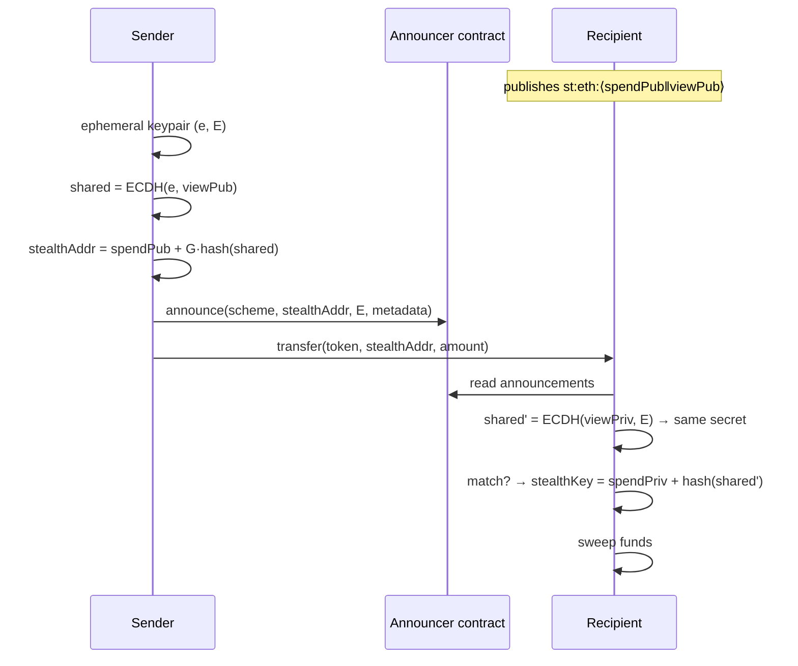
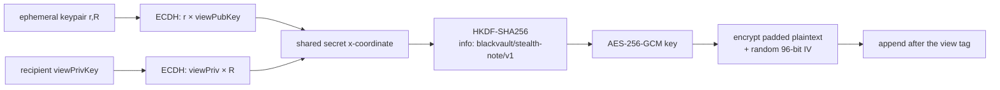

<p align="center">
  
</p>

<h1 align="center">BlackVault</h1>

<p align="center"><i>Private money on Robinhood Chain. On-chain, but off the radar.</i></p>

<p align="center">
  
  
  
  
  
  
</p>

<p align="center">
  <b>The first privacy layer on Robinhood Chain.</b><br>
  <sub>A fresh address for every payment · encrypted messages that ride along · the provider never sees your IP<br>
  <a href="https://blackvault.cash">blackvault.cash</a> ·
  <a href="https://app.blackvault.cash">app</a> ·
  <a href="https://docs.blackvault.cash">docs</a></sub>
</p>

---

Public blockchains were built to be read. Every transfer you make is a line in a
ledger anyone can query — who paid whom, how much, how often, and what your
balance was before and after. Banks at least keep that between you and them.

BlackVault is a wallet that closes the gap it can actually close, and says
plainly what it cannot. Payments land on one-time addresses nobody can link back
to you. Messages travel encrypted inside the payment itself. Network requests go
through our own server, so the RPC provider never learns which addresses belong
to which IP.

No new seed phrase, no browser extension, no bridge to a privacy chain. Sign in
with Google, and the privacy is already on.

---

## Before / After

A normal ERC-20 transfer, as the chain sees it:

```
Transfer(from: 0xYourWallet, to: 0xTheirWallet, value: 20000000)
       │                          │
       └── your identity          └── theirs, linked to you forever
```

The same payment through BlackVault:

```
Announce(schemeId: 1, stealthAddress: 0x9f3c…, ephemeralPubKey: 0x02a7…, metadata: 0x2a01…)
Transfer(from: 0xYourWallet, to: 0x9f3c…, value: 20000000)
       │                          │             │
       │                          │             └── encrypted note, only they can read
       │                          └── a fresh address, used once, never reused
       └── still you (see the honest table below)
```

The recipient scans announcements with a viewing key, finds the ones meant for
them, and sweeps the funds. Nobody watching the chain can tell which
announcements belong to which person.

---

## The privacy model, stated honestly

Privacy claims deserve precision. Here is exactly what ships today:

| Property | Status | How |
|---|:--:|---|
| **Recipient identity** | 🟢 Hidden | ERC-5564 stealth address, fresh per payment |
| **Payment linkability** | 🟢 Broken | No address reuse; announcements are unlinkable without the viewing key |
| **Message content** | 🟢 Encrypted | ECIES to the recipient's viewing key |
| **Message length** | 🟢 Hidden | Fixed-size padding |
| **Your IP** | 🟢 Hidden | Same-origin proxy for RPC, ENS, prices, news, images |
| **App access** | 🟢 Gated | WebAuthn biometric lock (Face ID / Touch ID / Hello) |
| **Amount** | 🔴 Public | No shielded pool on this chain yet — see [roadmap](#roadmap) |
| **Sender identity** | 🔴 Public | The transfer leg is signed by your wallet |
| **Gas payer** | 🟡 Public | Sponsored claims are built but parked behind a flag |

We would rather lose a bullet point than overstate one. If a property is not
green above, do not assume it.

---

## How it works

Seven layers, each one solving a problem the one below it leaves open.

1. **Sign in** — Google or email via Privy. An embedded, self-custodial EVM
   wallet is provisioned; the private key never leaves the user.
2. **Derive a stealth identity** — one fixed message is signed to derive a
   spending key and a viewing key, deterministically. Same wallet, same keys,
   forever — so a cleared browser never orphans funds.
3. **Publish a meta-address** — `st:eth:0x<spend><view>`, or a human name like
   `you.blackvault.eth`. That is what you share.
4. **Receive** — the sender computes a one-time address from your meta-address,
   sends there, and announces it on-chain.
5. **Scan** — your wallet walks the announcements and tests each one against
   your viewing key. Matches are yours; nobody else can tell.
6. **Read the note** — the same viewing key decrypts the message the sender
   attached inside the announcement metadata.
7. **Sweep** — the stealth key is derived from your spending key and the
   ephemeral key, and the funds move to your wallet.

---

## Cryptography

### Stealth addresses (ERC-5564)



The sender never learns the recipient's spending key. The recipient never has to
be online. Everything is derived from one ECDH agreement that both sides can
compute and nobody else can.

### Encrypted notes

An ERC-20 transfer has nowhere to write a message — `transfer(to, amount)` takes
two arguments and the calldata is fully consumed. But the announcement carries a
`metadata` blob that was using **exactly one byte** (the view tag), and scanners
read only that first byte.

So we filled the rest.



**Wire format**

```
┌────────┬────────┬─────────────────────┬────────────┬─────────────────────────┐
│ 1 byte │ 1 byte │      33 bytes       │  12 bytes  │        144 bytes        │
├────────┼────────┼─────────────────────┼────────────┼─────────────────────────┤
│ view   │ version│ ephemeral pubkey    │ AES-GCM IV │ ciphertext + auth tag   │
│ tag    │        │ (compressed)        │            │ (128B padded plaintext) │
└────────┴────────┴─────────────────────┴────────────┴─────────────────────────┘
  ^ unchanged — legacy scanners keep working
```

**Why the viewing key.** It is the key the recipient already uses to find the
payment. No new secret, no key exchange, no server, no consent step. The rule is
simple: *if you can find the payment, you can read the note. If you cannot, you
cannot.*

| Design decision | Reason |
|---|---|
| Fixed 128-byte plaintext | Ciphertext size never leaks message length |
| Encryption failure → bare view tag | A note must never cost someone their payment |
| Decryption failure → "no note" | Legacy announcements and other people's payments still scan |
| Version byte | Room to rotate the scheme without breaking old data |

Cost: ~190 extra bytes of calldata, roughly **3,000 gas**. Negligible on an L2.

### What this does not protect

- The **existence** of a note is visible; the content is not.
- A note is **not proof of sender identity** — anyone can encrypt to a published
  meta-address. GCM authenticates integrity, not authorship.
- **No forward secrecy** — a leaked viewing key exposes past notes, exactly as it
  exposes past payments.
- **Public sends carry no note.** Public money has no private channel; that is
  deliberate, and it is a reason to send privately.

---

## Architecture

```
blackvault/
├── apps/web/                          Next.js 16 · App Router · Turbopack
│   ├── src/lib/chain/evm/
│   │   ├── stealth.ts                 ERC-5564 derive · send · scan · sweep
│   │   ├── note-crypto.ts             ECIES notes (ECDH → HKDF → AES-GCM)
│   │   ├── rail-evm.ts                PrivateRail implementation
│   │   ├── adapter.ts                 balances · transfers · explorer links
│   │   ├── aa.ts                      ERC-4337 sponsored claims (flagged off)
│   │   ├── names-store.ts             ENS subname records (Postgres)
│   │   └── config.ts                  chain defs · RPC targets
│   ├── src/app/api/
│   │   ├── rpc/evm · rpc/ens          same-origin proxies — provider never sees user IP
│   │   ├── names/*                    subname claim · resolve · CCIP-Read gateway
│   │   ├── degen/trending             live RH Chain pools
│   │   └── prices · news · x          proxied market and feed data
│   ├── src/ui/                        the entire visual layer, one file per surface
│   └── contracts/names/               BlackVaultOffchainResolver.sol
└── packages/sdk/                      portfolio + agent primitives
```

**Chain interaction** goes through viem against Robinhood Chain (Arbitrum Orbit
L2, chainId `4663`; testnet `46630`). **Every browser-side RPC call** is routed
through `/api/rpc/evm`, so the node provider sees our server, never a user IP
correlated with the addresses being queried.

---

## Features

| | Feature | What it does |
|:--:|---|---|
| 🔒 | **Private send / receive** | Stealth address per payment, unlinkable on-chain |
| ✉️ | **Encrypted notes** | A message only the recipient's viewing key can open |
| 🏪 | **Private Merchant** | Payment requests (QR + link) that land on fresh addresses |
| 🏷️ | **BlackVault Names** | Self-hosted ENS subnames, CCIP-Read resolver, paid in USDG |
| 🛡️ | **Biometric lock** | WebAuthn gate on the vault, per device |
| 📊 | **Unified activity** | Public chain history + local private log + semantic journal |
| 🔥 | **Private Degen** | Live trending pools on Robinhood Chain |
| 📰 | **News Hub** | Proxied feeds — the image CDN never sees your IP |
| 💳 | **Card** | Coming soon |
| 🤖 | **Vault Keeper** | AI agent — coming soon |

---

## Getting started

```bash
pnpm install
cp apps/web/.env.local.example apps/web/.env.local    # fill in the values
pnpm --filter web dev
```

Requires **Node 20+** and **pnpm**.

```bash
pnpm --filter web test        # vitest
pnpm --filter web build       # production build
```

### Environment

| Variable | Purpose |
|---|---|
| `NEXT_PUBLIC_PRIVY_APP_ID` | Embedded wallet auth |
| `NEXT_PUBLIC_EVM_NETWORK` | `mainnet` or unset for testnet |
| `EVM_RPC_URL` | Server-side RPC target (kept out of the client bundle) |
| `EVM_LOGS_RPC_URL` | Wide-range `eth_getLogs` endpoint for stealth scanning |
| `NEXT_PUBLIC_ANNOUNCER_ADDR` | Deployed ERC-5564 announcer |
| `NEXT_PUBLIC_USDG_ADDR` | Stablecoin contract (USDC/USDT optional) |
| `NAMES_DATABASE_URL` | Postgres for subname records |
| `NAMES_GATEWAY_KEY` | Key that signs CCIP-Read answers |
| `UPSTASH_REDIS_REST_URL` / `_TOKEN` | Per-IP rate limiting |

The full list, with mainnet reference values, is in
[`apps/web/.env.local.example`](apps/web/.env.local.example).

---

## Roadmap

| | Item | State |
|:--:|---|---|
| ⬜ | **Announcement indexer** | Designed. Turns scanning from an RPC sweep into a DB query — unblocks scale |
| ⬜ | **Shielded pool** | Privacy Pools design done; makes amounts and sender private |
| ⬜ | **Sponsored claims** | Built, parked behind `NEXT_PUBLIC_EVM_GASLESS` pending an EIP-7702 fix |
| ⬜ | **Private swap** | Gated on a DEX venue existing on Robinhood Chain |
| ⬜ | **Card** | Gated on issuer support for this chain and stablecoin |

---

## FAQ

**Is this custodial?**
No. Wallets are embedded and self-custodial via Privy; keys never leave the
user. Stealth keys are derived from a signature, never stored on a server.

**What happens if I clear my browser?**
Your funds are safe. Stealth keys are derived deterministically from a fixed
signed message, so signing in again reproduces them exactly. Local history
(private log, notes you sent) is device-local and will be gone.

**Can BlackVault read my notes?**
No. They are encrypted to your viewing key before they ever leave the browser,
and we never hold it.

**Are amounts private?**
Not yet. See the [privacy model](#the-privacy-model-stated-honestly) — that
requires a shielded pool, which is on the roadmap.

**Has it been audited?**
No. The stealth implementation builds on ScopeLift's audited ERC-5564 SDK, but
this application has not been audited. Treat it accordingly.

**Why Robinhood Chain?**
It is an EVM L2 with real stablecoin liquidity and no privacy layer. We would
rather be the privacy layer of one chain than a thin wrapper on ten.

---

## Security

- Secrets live only in `.env.local`, which is gitignored. Never commit them.
- All browser RPC traffic is proxied server-side; direct provider calls from the
  client are a regression, not an optimisation.
- Per-IP rate limiting sits in front of every public API route.
- Report a vulnerability privately: **contact@blackvault.cash**

---

## License

All rights reserved. No license granted yet.

<p align="center"><sub>Built on Robinhood Chain · <a href="https://blackvault.cash">blackvault.cash</a></sub></p>
