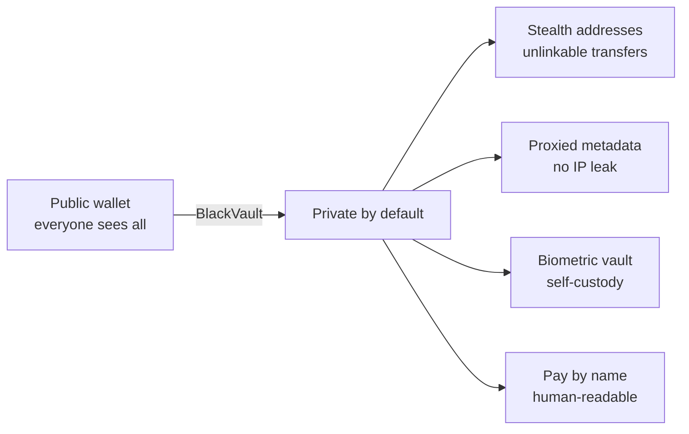

About BlackVault

# The Problem & Our Solution

## The problem: crypto has no privacy

Every public blockchain is a permanent, searchable record of your entire
financial life. Anyone with your address can see:

- **Exactly how much you hold** — down to the cent, forever.
- **Every counterparty** — who paid you, who you paid, when, how often.
- **Your full history** — salary, savings, trades, donations, everything.

And it gets worse off-chain. The moment your wallet queries a normal RPC
provider, that provider logs **your IP address next to the addresses you care
about** — deanonymizing you even if the chain data alone couldn't.

> On-chain, you are a glass wallet. Everyone can see inside, and the record
> never forgets.

Existing "privacy" tools ask for hard trade-offs: hand funds to a custodial
mixer (trust + regulatory risk), run complex expert tooling, or bridge to a
niche privacy chain with no liquidity and no everyday apps.

## The solution: privacy as the default

BlackVault makes privacy the **normal way to use a wallet** — no mixer, no
expert setup, no leaving the ecosystem.

| The problem | BlackVault's answer |
| --- | --- |
| Balances are public | **Stealth addresses** — funds land where only you can find them |
| Transfers link people | **ERC-5564** breaks the sender↔receiver link on-chain |
| RPC leaks your IP | **Same-origin proxies** — no third party sees IP + address |
| Mixers require trust | **Non-custodial**, standard contracts, keys stay yours |
| Privacy tools are hard | **One-tap** private send, receive, and pay-by-name |
| Privacy chains are empty | Built on **Robinhood Chain** — retail distribution + real assets |

## Why now

Three things line up for the first time:

1. **ERC-5564 stealth addresses** are standardized with canonical singleton
   contracts — privacy without a custom mixer is finally practical.
2. **Robinhood Chain** brings a mainstream, retail-scale distribution channel
   and tokenized real-world assets to an EVM L3 with sub-cent fees.
3. **Embedded wallets + passkeys** removed the seed-phrase barrier — privacy
   can now ship inside an app anyone can use.

BlackVault is where these meet: **consumer-grade privacy, on the chain with the
biggest consumer funnel.**
