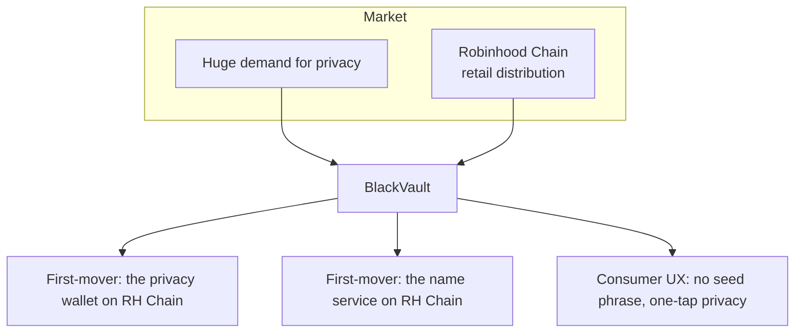
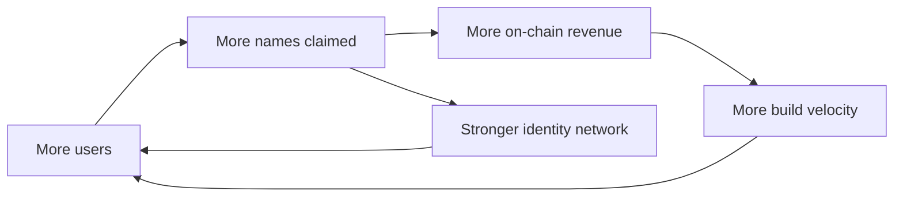

About BlackVault

# Why BlackVault

## The one-liner

**BlackVault is the private-by-default wallet for Robinhood Chain** — stealth
transfers, pay-by-name, and a biometric vault, live on mainnet with real
on-chain revenue from day one.

## The opportunity

Privacy is the largest unmet need in crypto, and the market has been forced to
choose between bad options — custodial mixers, expert-only tooling, or empty
privacy chains. Meanwhile, **Robinhood Chain** arrives with something no privacy
chain ever had: a mainstream, retail-scale distribution funnel and tokenized
real-world assets.

BlackVault sits exactly at that intersection:

## Why we win — the moat

1. **First mover, category defining.** BlackVault is the privacy wallet **and**
   the name service on Robinhood Chain. Names create a sticky, network-effect
   identity layer: your `you.blackvaultwallet.eth` is your handle across the
   ecosystem.
2. **Standards, not trust.** Built on canonical ERC-5564 / ERC-6538 contracts —
   no custodial mixer, no honeypot, nothing to seize. Privacy that regulators
   can't simply switch off because there's no operator holding funds.
3. **Consumer-grade UX.** Google sign-in, passkeys, Face ID lock, pay-by-name,
   one-tap private send. Privacy that a first-time user can actually use — the
   thing every prior privacy project failed at.
4. **Full-stack privacy.** Not just on-chain: every RPC, price, and data request
   is proxied, so metadata never leaks either. Competitors stop at the chain.
5. **Revenue live now.** The name service already charges an on-chain fee to a
   revenue wallet, verified per-transaction. Real usage → real income, not a
   promise.

## Traction & momentum

- **Live on mainnet** at [app.blackvault.cash](https://app.blackvault.cash) —
  stealth transfers, names, biometric vault, payment requests, news & markets.
- **Revenue engine shipping** — pay-per-name, settled and verified on-chain.
- **Product velocity** — a full private wallet, name service, and docs built and
  deployed on a continuous pipeline.
- **Expansion-ready** — the chain layer is adapter-based; Ethereum, Arbitrum,
  Base, and Optimism are already staged in the UI.

## The flywheel

Names drive identity and revenue; identity and revenue drive growth; growth
funds the next features — private trading, the card, shielded pools.

## For holders

BlackVault's roadmap points at a native token (`$BV`, teased in-app) as the
coordination and value layer of a growing private-finance ecosystem — powering
names, private trading, and the card. **Every feature we ship widens the moat
and deepens the reasons to hold.** Follow the [roadmap](/roadmap) for what's
next, and [coming soon](/roadmap#coming-soon) for what's being built now.

> Private by default. Auditable by choice. Built for the next hundred million
> users who deserve financial privacy without giving up control.
