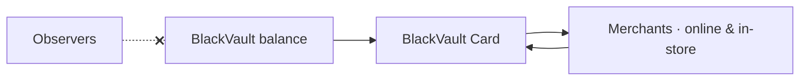

Under Development

# BlackVault Card

Spend your on-chain balance in the real world — privately.

A card showcase already ships in the app (Home → **Card**); the issuance and
spend rails below are being built.

## The idea

The last mile of private money is spending it. BlackVault Card bridges your
vault to everyday payments without turning every purchase into a public
on-chain record tied to your identity.

## What it will offer

| Feature | What it does |
| --- | --- |
| 💳 **Spend anywhere** | Use your BlackVault balance at everyday merchants |
| 🕶️ **Private by design** | Purchases don't expose your wallet or holdings on-chain |
| 🔐 **Self-custodial funding** | You fund and control the card from your own vault |
| 📲 **In-app management** | Issue, freeze, and manage the card from BlackVault |

## Status

The card visual and issuance showcase are live in the app under a coming-soon
state. Card issuance, funding, and spend integration are in active development.
Track it on the [roadmap](/roadmap).
