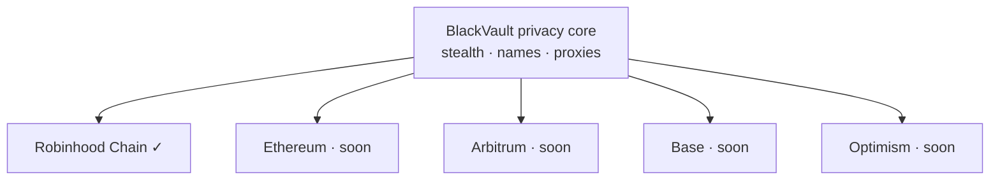

Under Development

# Multichain

BlackVault's privacy, beyond Robinhood Chain — the same stealth transfers and
names across the major EVM networks.

The network selector is **already in the app** on Send and Receive; Ethereum,
Arbitrum, Base, and Optimism appear as **Soon** and light up as each is wired.

## Why it's ready

BlackVault's chain layer is `defineChain` + adapter-based from day one. Adding a
network is configuration, not a rewrite — the stealth rail, names, and privacy
proxies are chain-agnostic.

## What it will offer

| Feature | What it does |
| --- | --- |
| 🌐 **One wallet, many chains** | Switch networks from the same vault and identity |
| 🕶️ **Privacy everywhere** | Stealth transfers on every supported network |
| ✨ **Portable names** | Your `blackvaultwallet.eth` identity travels with you |

## Status

Chains are staged in the UI and enabled one at a time as they're validated.
Follow the [roadmap](/roadmap).
