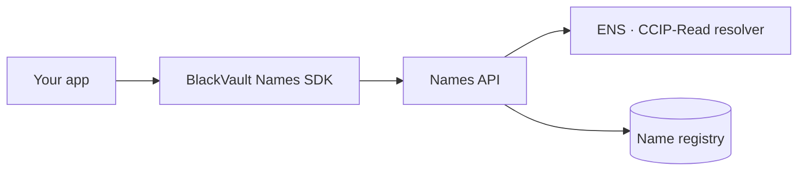

Under Development

# Names API & SDK

Let any app issue and resolve BlackVault Names — the identity layer as a
developer product.

## The idea

BlackVault Names already work end to end: subnames under `blackvaultwallet.eth`,
on-chain-verified paid claims, and a CCIP-Read gateway that lets any ENS-aware
wallet resolve them. The next step is opening that engine to builders.

## What it will offer

| Surface | What it does |
| --- | --- |
| 🧩 **SDK** | Claim, resolve, and manage names from your own frontend |
| 🔌 **API** | Server-side issuance and lookup with signed CCIP-Read answers |
| 💰 **Monetizable** | Set your own claim pricing, settled on-chain |
| 🌍 **ENS-native** | Names resolve anywhere ENS is supported, no lock-in |

## Status

The name service that powers this is live in production. The public API surface
and SDK are in active development. Follow the [roadmap](/roadmap).
