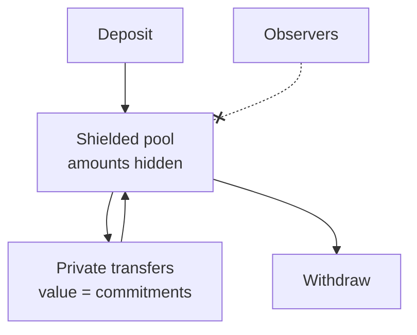

Under Development

# Private Balance

The next leap in privacy: a shielded pool that hides **amounts**, so your
balance becomes fully invisible — not just unlinkable.

## Where we are today

Stealth transfers already hide the **recipient** and break the
**sender ↔ receiver link**, and your private balance is spread across one-time
addresses only your keys can find. Private Balance completes the picture by
hiding the **numbers** as well.

## How it will work

Funds deposit into a shielded pool. Inside the pool, balances and transfer
amounts are represented as cryptographic commitments — value moves and settles
without any on-chain figure to read.

## What it unlocks

| Hidden today | Hidden with Private Balance |
| --- | --- |
| Recipient | Recipient |
| Sender ↔ receiver link | Sender ↔ receiver link |
| Your IP ↔ address | Your IP ↔ address |
| — | **Transfer amounts** |
| — | **Your total balance** |

The result: your BlackVault balance appears simply as **••••• ** to the outside
world, visible only to you.

## Status

Design and integration are in active development. It will surface in the app as
the **Private Balance** experience inside the Vault. Follow the
[roadmap](/roadmap).
