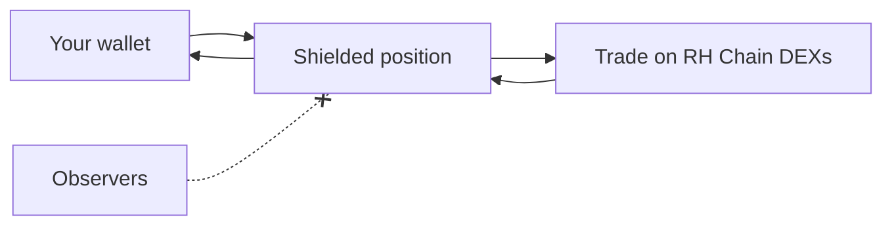

Under Development

# Private Degen

Shielded trading for Robinhood Chain tokens — trade the trenches without your
positions ever linking back to your public wallet.

A live preview already ships in the app (the **Degen** tab), driven by real
trending-token data; the private trading engine below is being built.

## The idea

Public DEX trading is a confession: every buy, every sell, every position size
is tied to your address forever. Snipers copy you, competitors front-run you,
and anyone can reconstruct your entire strategy.

**Private Degen** puts trading behind BlackVault's privacy layer:

Your funds enter a shielded position; trades execute on-chain; observers see
market activity but **cannot attribute it to you** or read your size.

## What it will offer

| Feature | What it does |
| --- | --- |
| 🕶️ **Private positions** | Enter and exit without linking trades to your public address |
| 📈 **Live trenches** | Realtime trending tokens, price, mcap, volume, liquidity (**live now** in preview) |
| ⚡ **Fast & cheap** | Robinhood Chain's sub-cent fees make private trading practical |
| 🔒 **Non-custodial** | Positions stay yours — no venue holds your funds |

## Status

The Degen board (ticker, trending list, charts) is live as a preview under an
**Under development** overlay. Shielded execution, private position tracking,
and the swap flow are in active build. Track progress on the [roadmap](/roadmap).
