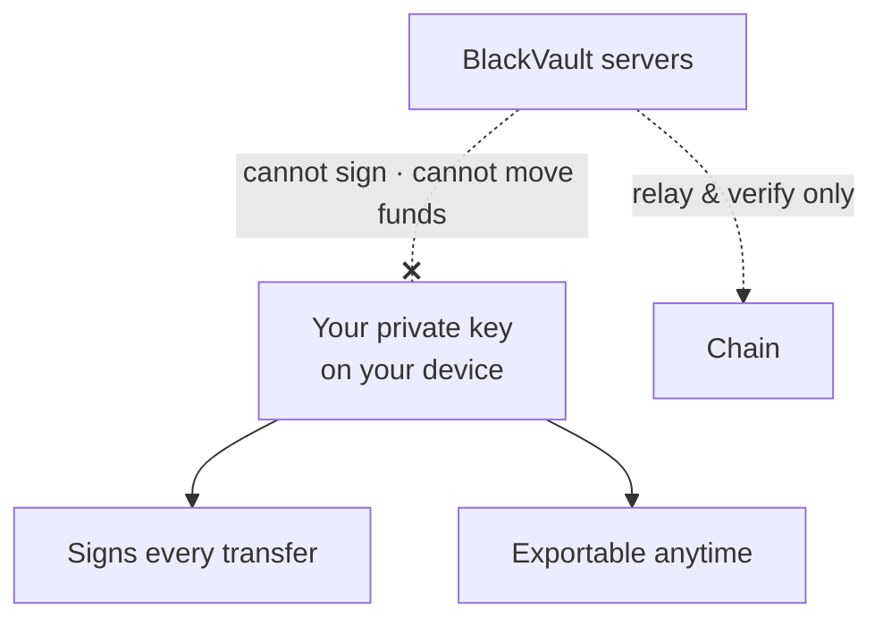

Concepts

# Custody Model

**Your keys, your vault.** BlackVault uses embedded wallets so onboarding feels
like a normal app — while custody stays entirely with you.

## Why this is safe for you

BlackVault is **fully self-custodial**. That is the single most important safety
property of the whole product:

- **We never hold your funds.** There is no BlackVault account, deposit address,
  or omnibus wallet. Your money sits in *your* wallet, controlled by *your* key.
- **We cannot move your funds.** Every transfer is signed on your device by your
  key. No server, admin, or backend has the ability to send on your behalf.
- **We cannot freeze or seize your funds.** There's no operator switch — nothing
  for us, a regulator, or an attacker to flip, because no one but you controls
  the key.
- **You can leave anytime.** Export your private key (Settings → Export) and
  import it into MetaMask, Rabby, or any EVM wallet. No lock-in, ever.
- **Nothing to hack on our side.** Since we don't custody funds, there is no
  honeypot — a server breach cannot drain wallets it never controlled.

> The rule is simple: **you sign, or it doesn't happen.** BlackVault's servers
> only relay data and verify public facts — they never touch your keys.

## How your key exists

- Created on sign-in (Google or email) using distributed key infrastructure —
  no seed-phrase ceremony, and no key is ever assembled on a server.
- Usable only from your authenticated session on your device.
- **Exportable at any time** (biometric-gated when the vault lock is on).

## Layers in front of the key

| Layer | Protects against |
| --- | --- |
| Google/email session + passkeys | Account takeover |
| Biometric vault lock (WebAuthn) | Someone holding your unlocked device |
| Slide-to-confirm on every send | Accidental or scripted transfers |
| Gas & destination preflights | Broken or misdirected transactions |

## Stealth keys

Your private-balance identity (spending + viewing keys) is **derived, not
stored** — one wallet signature per session recreates it. Nothing sensitive
sits on disk; clearing your browser costs you nothing but a re-sign.

## What BlackVault cannot do

- Move, freeze, or seize your funds.
- See your private log or balances beyond what's public on-chain.
- Stop you from leaving with your key.

That's not a promise we ask you to trust — it's a property of how the system is
built. **Self-custody isn't a setting; it's the foundation.**
