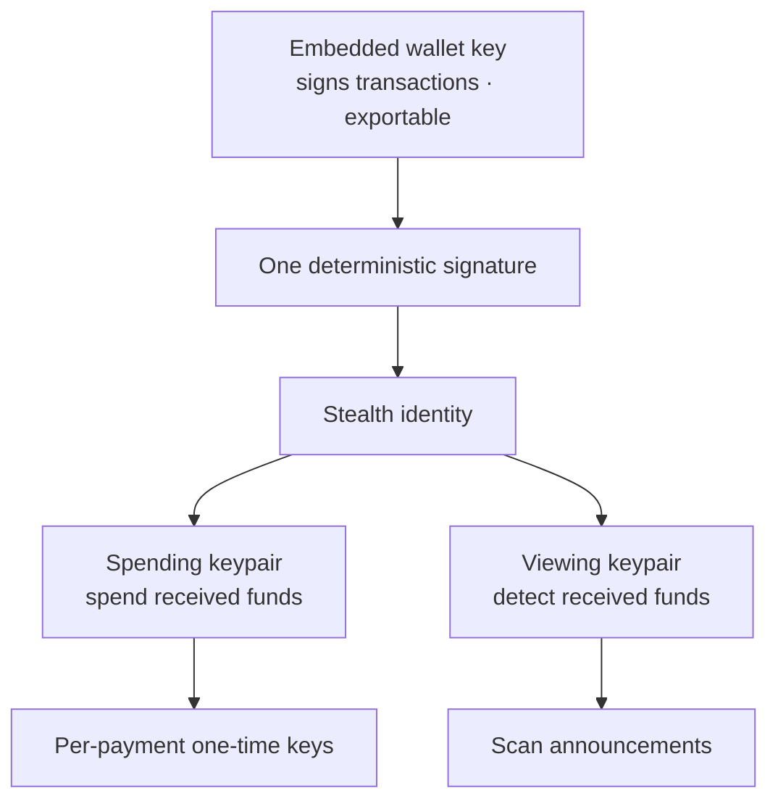

Concepts

# Key Architecture

BlackVault separates the keys that **sign transactions** from the keys that
**power privacy** — and the privacy keys are derived on demand, never stored.

## The key hierarchy

## The keys, one by one

### Wallet key (custody)

Your embedded-wallet private key — the one that signs every transaction and
that you can **export any time**. Created at sign-in via distributed key
infrastructure; usable only from your authenticated session. This is the key
that makes BlackVault self-custodial.

### Stealth identity (derived)

A single deterministic signature from the wallet key seeds your **stealth
identity**. Because it's derived, it never needs storing — reload the app,
re-sign, and the exact same identity comes back.

### Spending keypair

Controls the money. The private spending key derives the one-time private key
for each incoming payment, which is what actually **spends** funds swept from a
stealth address. Whoever holds it controls your private balance.

### Viewing keypair

Controls detection. The private viewing key lets you **scan** ERC-5564
announcements and recognize which one-time addresses are yours — without the
ability to spend. This is the key you could hand an auditor for *read-only*
proof, without giving up control of funds.

### Per-payment one-time keys

For each payment, the sender's fresh ephemeral key + your viewing key produce a
unique address `P`; your spending key derives `P`'s private key at claim time.
New key per payment ⇒ every payment is unlinkable.

## Where keys live

| Key | Storage | Lifetime |
| --- | --- | --- |
| Wallet key | Managed by the embedded-wallet session | Persistent · exportable |
| Stealth identity | **Nowhere at rest** | Re-derived each session from a signature |
| Spending / viewing | In-memory during the session | Cleared on close, re-derived on demand |
| One-time keys | Computed at claim time | Ephemeral |

Only **public** scan progress (block cursors, matched public addresses) is
persisted — never key material. Clearing your browser costs you nothing but a
re-sign.

## Why this matters

- **Nothing sensitive at rest** — a stolen device disk yields no stealth keys.
- **Read/spend separation** — you can prove receipt (viewing) without exposing
  spend authority.
- **Deterministic recovery** — your privacy identity is recoverable from your
  wallet alone, no extra backup to lose.
