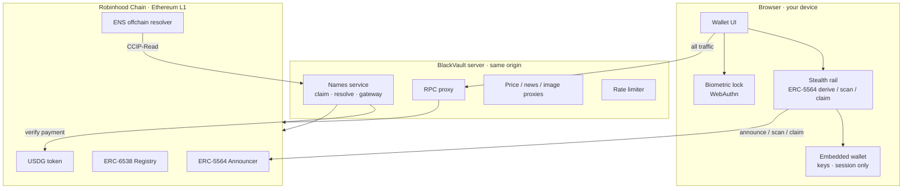
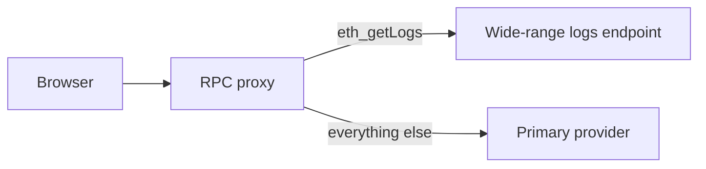

Concepts

# Architecture Overview

BlackVault is a client-heavy wallet with a thin, privacy-preserving server. The
browser holds keys and does the sensitive crypto; the server only ever relays
and verifies — it never sees your keys.

## System map

## Design principles

| Principle | Consequence |
| --- | --- |
| **Keys never leave the client** | The server can't move or see funds |
| **Nothing sensitive at rest** | Stealth keys are derived per session, not stored |
| **Every fetch is same-origin** | No third party correlates IP with address |
| **Standard contracts only** | Canonical ERC-5564 / 6538 singletons, no custom mixer |
| **Fail-safe ordering** | Announce → verify → transfer; receipts checked each step |

## Component responsibilities

- **Wallet UI** — the whole product surface; fully open in the
  [public repository](https://github.com/blackvaultwallet/Blackvault-App).
- **Stealth rail** — derives your identity, computes one-time addresses, scans
  announcements, and claims funds. See [Stealth Transfers](/concepts/stealth).
- **Names service** — issues subnames, verifies on-chain payment, and signs
  CCIP-Read answers. See [Names Architecture](/concepts/names-architecture).
- **Privacy proxies** — relay RPC/prices/news/images so metadata never leaks.
  See [Privacy Proxies](/concepts/privacy-proxies).
- **Biometric lock** — a device WebAuthn credential gating the UI. See
  [Biometric Lock](/guides/biometric-lock).

## Chain layer

Robinhood Chain (Arbitrum Orbit L3, chainId `4663`). A dual-RPC split keeps
reads fast and log scans wide:

The chain layer is `defineChain` + adapter-based, so adding Ethereum, Arbitrum,
Base, or Optimism (staged in the UI as **Soon**) is configuration, not a rewrite.
