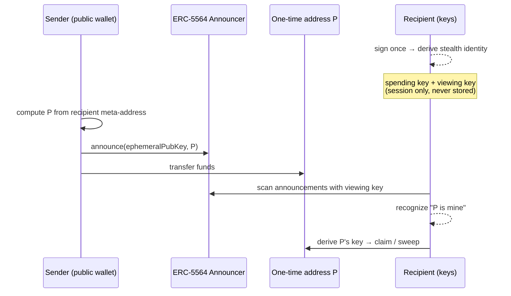

Concepts

# Privacy Model

The precise answer to "what does BlackVault hide, what does it not, and how?"

## What is hidden

| Hidden | How |
| --- | --- |
| **The recipient** | Funds land on a fresh one-time address, unlinkable to the recipient's identity |
| **The sender ↔ receiver link** | The two public identities never touch — no observer can connect them |
| **Your private balance** | Spread across one-time addresses only your keys can find and sum |
| **Your payment history (private)** | The private log lives only on your device |
| **Your IP ↔ address** | Every RPC and data request is proxied — no provider ever sees them together |
| **Gas footprint** | ERC-20 claims are gas-funded just-in-time, so a fresh stealth address needs no prior on-chain trail |

## Under development

| Coming | What it adds |
| --- | --- |
| 🔒 **Private balance (amount-hiding)** | A shielded pool so on-chain **amounts** are hidden too — your balance becomes fully invisible, not just unlinkable |
| 🚀 **Private Degen** | Shielded trading so token positions never link to your public wallet |

## How it works, in one picture

The math: `P` is derived by ECDH between the sender's fresh ephemeral key and
the recipient's public **viewing** key, tweaked by the recipient's public
**spending** key. Only the holder of both private keys can (a) *detect* that a
payment is theirs and (b) *spend* it. Every payment uses a new ephemeral key, so
every `P` is different and unlinkable.

## Why this approach wins

- **No trusted mixer.** Nothing pools your funds; there's no operator, no
  honeypot, nothing to hack or seize.
- **Standardized.** ERC-5564 + the canonical ERC-6538 registry — the same
  singletons used across EVM, audited by the wider ecosystem.
- **Unlinkable, not just obscured.** Each payment address is cryptographically
  independent — not a reshuffle an analyst can untangle.
- **Metadata-complete.** On-chain privacy plus proxied off-chain traffic; most
  "private" wallets leak your IP at the RPC and undo everything.
- **Selective disclosure.** Because you hold the viewing key, you can *prove*
  ownership or reveal a payment when you choose — auditable by choice.

## Threat model, briefly

| Adversary | Can they? |
| --- | --- |
| Chain analyst | **Cannot** link recipients, connect sender to receiver, or find your private balance |
| RPC provider | **Cannot** tie your IP to your addresses (proxied) |
| BlackVault server | **Cannot** see or move funds — keys never leave your device |
| Someone with your unlocked phone | **Cannot** open the vault or export keys (biometric gate) |
| A fully compromised device / account | Outside any wallet's control — protect sign-in with passkeys |
