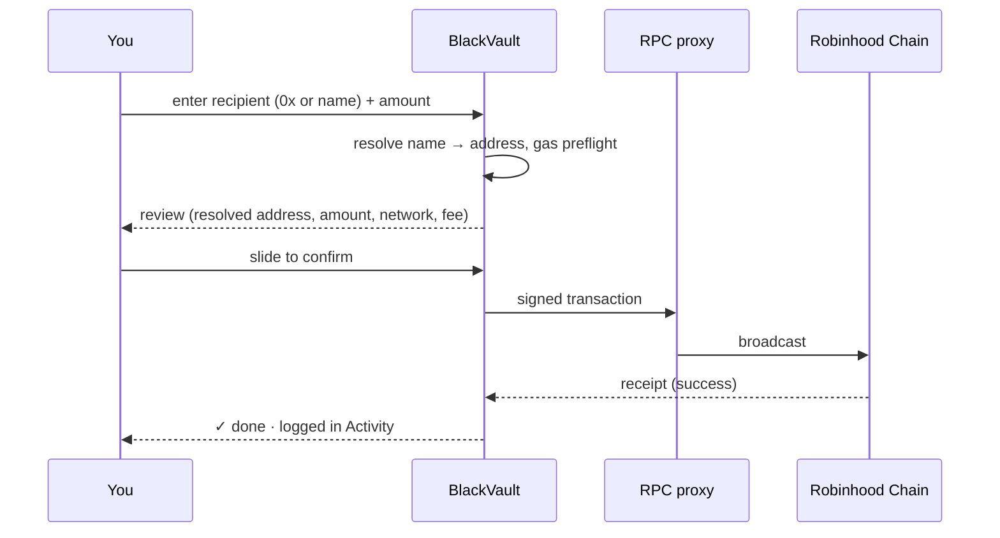
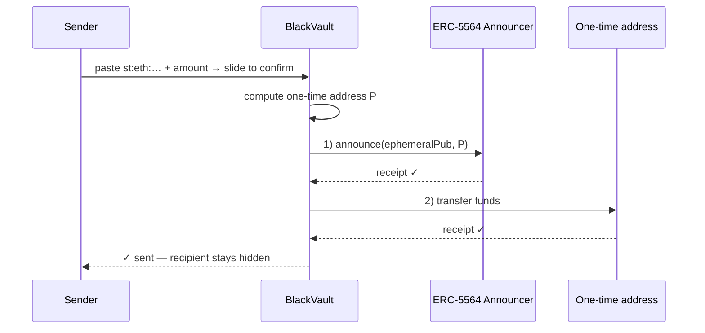
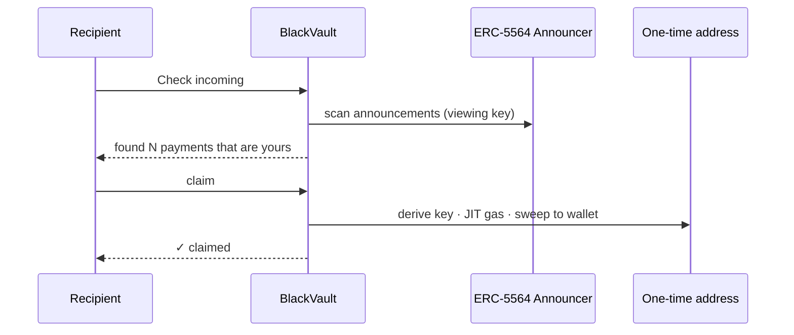
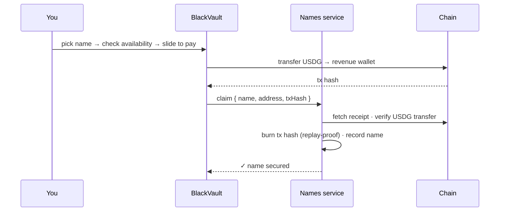

Concepts

# Transaction Lifecycle

Every value transfer follows a safety-ordered path. Nothing signs silently, and
no step can strand funds.

## Public send

The **review + slide-to-confirm** gate is mandatory; the app also refuses early
if ETH can't cover the fee.

## Private (stealth) send

**Order matters:** announce first (verified), *then* move funds. A failed
announce aborts before value moves, so money can never land somewhere the
recipient can't find.

## Receiving privately (scan → claim)

## Name claim (paid)

## Guarantees across every path

- **Explicit consent** — a slide gate before anything signs.
- **Gas preflight** — sends refuse rather than hang on an empty tank.
- **Receipt checks** — each step verifies success before the next.
- **Atomic name payments** — payment verification + rename in one DB
  transaction; a payment hash can never be reused.
